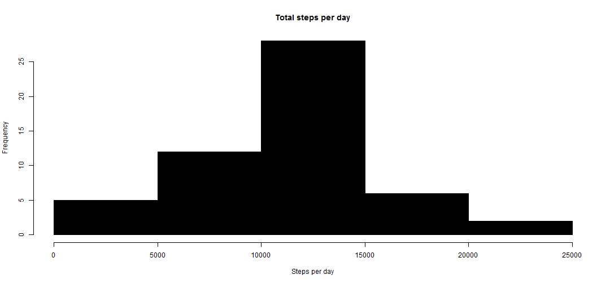
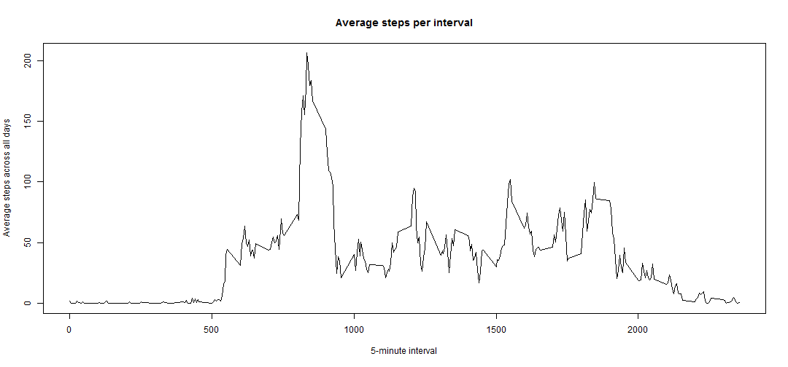
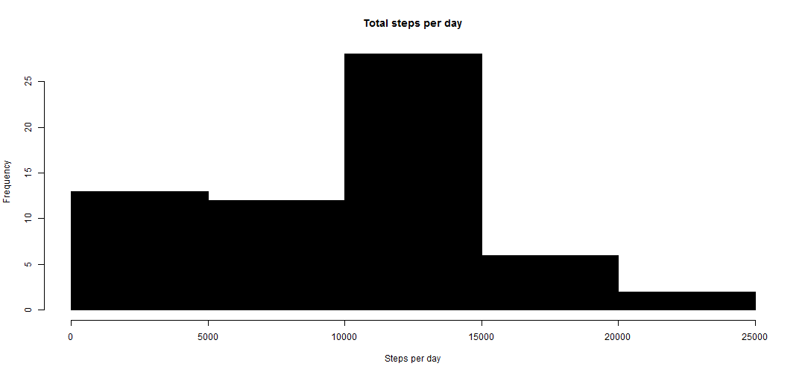
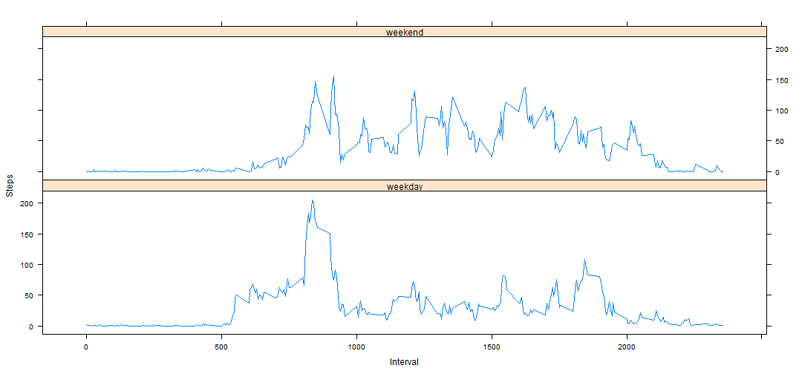

## Loading and preprocessing the data

Unzip the activity data and load it into R:


```r
unzip("activity.zip")
rawData <- read.csv("activity.csv")
```


## What is mean total number of steps taken per day?

Note: for this part of the assignment, we will ignore the missing values in the dataset.

1. First we calculate the total number of steps taken per day:


```r
stepsPerDay <- aggregate(rawData$steps, list(rawData$date), sum)
colnames(stepsPerDay) <- c("date", "steps")
```

2. We show this aggregated data in a histogram:


```r
hist(stepsPerDay$steps, col="black", main="Total steps per day", xlab="Steps per day")
```

 

3. Calculate and report the mean and median of the total number of steps taken per day:


```r
# Mean
stepsPerDayMean <- mean(stepsPerDay$steps, na.rm=TRUE)
print(stepsPerDayMean)
```

```
## [1] 10766.19
```

```r
#Median
stepsPerDayMedian <- median(stepsPerDay$steps, na.rm=TRUE)
print(stepsPerDayMedian)
```

```
## [1] 10765
```


## What is the average daily activity pattern?

1. Aggregate the steps by interval:


```r
intervalSteps <- aggregate(data=rawData, steps~interval, FUN=mean, na.action=na.omit)
colnames(intervalSteps) <- c("interval", "steps")
```

2. Create a plot from the aggregated data:


```r
plot(x=intervalSteps$interval, y=intervalSteps$steps, type="l", main="Average steps per interval", 
     xlab="5-minute interval", ylab="Average steps across all days")
```

 

3. As we can see from this graph, the interval with the maximum number of steps is the following:


```r
maxInterval <- intervalSteps[intervalSteps$steps==max(intervalSteps$steps),c(1)]
print(maxInterval)
```

```
## [1] 835
```


## Imputing missing values

1. Number of rows with NAs in the data:


```r
countNAs <- nrow(subset(rawData, is.na(rawData$steps)))
print(countNAs)
```

```
## [1] 2304
```

2. The NAs are replaced by the median values:


```r
stepValues <- data.frame(rawData$steps)
stepValues[is.na(stepValues),] <- tapply(X=rawData$steps,INDEX=rawData$interval,FUN=median,na.rm=TRUE)
filledData <- cbind(stepValues, rawData[,2:3])
colnames(filledData) <- c("steps", "date", "interval")
```


Now we will replicate the analysis we did at the beginning of this assignment but working with the new filled data without NAs:

1. First we calculate the total number of steps taken per day:


```r
filledStepsPerDay <- aggregate(filledData$steps, list(filledData$date), sum)
colnames(filledStepsPerDay) <- c("date", "steps")
```

2. We show this aggregated data in a histogram:


```r
hist(filledStepsPerDay$steps, col="black", main="Total steps per day", xlab="Steps per day")
```

 

3. Calculate and report the mean and median of the total number of steps taken per day:


```r
# Mean
filledStepsPerDayMean <- mean(filledStepsPerDay$steps, na.rm=TRUE)
print(filledStepsPerDayMean)
```

```
## [1] 9503.869
```

```r
#Median
filledStepsPerDayMedian <- median(filledStepsPerDay$steps, na.rm=TRUE)
print(filledStepsPerDayMedian)
```

```
## [1] 10395
```

As we can see comparing the analysis made on both datasets the values differ, being lower with the NAs.
Maybe if we had used a different method to replace the NAs the result may have been different.
In any case we can conclude that having NAs in the data has a big impact on the results.


## Are there differences in activity patterns between weekdays and weekends?

1. Create a new factor variable in the dataset with two levels - "weekday" and "weekend" indicating whether a given date is a weekday or weekend day:


```r
dayType <- data.frame(sapply(X=filledData$date, FUN=function(day) {
    if (weekdays(as.Date(day)) %in% c("Saturday", "Sunday", "sábado", "domingo")) {
        day <- "weekend"
    }
    else {
        day <- "weekday"
    }
}))

filledData <- cbind(filledData, dayType)
colnames(filledData) <- c("steps", "date", "interval", "dayType")
```

2. Aggregate the number of steps by this new variable and interval:


```r
dayTypeIntervalSteps <- aggregate(data=filledData, steps ~ dayType + interval, FUN=mean)
```

3. Make a panel plot containing a time series plot of the 5-minute interval and the average number of steps taken, averaged across all weekday days or weekend days:


```r
library("lattice")

xyplot(
    type="l",
    data=dayTypeIntervalSteps,
    steps ~ interval | dayType,
    xlab="Interval",
    ylab="Steps",
    layout=c(1,2)
)
```

 


